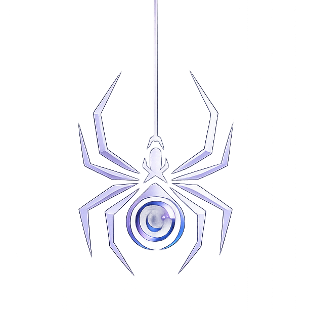

<div align="center">



# 🛡️ ThreatLens Frontend

### Modern Cybersecurity Dashboard Built with React, TypeScript & Vite


A modern, responsive frontend for **ThreatLens**, a cybersecurity platform designed to help security professionals monitor threats, visualize security insights, and manage incidents through an intuitive web interface.

</div>

---

# 📖 About

ThreatLens is a collaborative cybersecurity platform focused on delivering a clean, scalable, and user-friendly experience for security monitoring.

This repository contains the **frontend application**, built with modern web technologies and designed with performance, accessibility, and maintainability in mind.

The frontend focuses on creating an intuitive interface for authentication, dashboards, threat visualization, analytics, and user interaction.

---

# ✨ Features

- Responsive User Interface
- Modern Landing Page
- User Authentication Interface
- Dashboard Layout
- Modular Component Architecture
- Dark Theme
- Fast Performance with Vite
- Client-side Routing
- Reusable UI Components
- Mobile-Friendly Design

---

# 🛠 Tech Stack

### Frontend

- React
- TypeScript
- Vite
- Tailwind CSS
- React Router
- Lucide React

---

# 📂 Project Structure

```text
src/
├── assets/
├── components/
├── hooks/
├── layouts/
├── pages/
├── routes/
├── services/
├── utils/
├── App.tsx
└── main.tsx
```

---

# 🚀 Getting Started

### Clone the repository

```bash
git clone https://github.com/Sandeep-7981/ThreatLens-Frontend.git
```

### Navigate into the project

```bash
cd ThreatLens-Frontend
```

### Install dependencies

```bash
npm install
```

### Start the development server

```bash
npm run dev
```

### Build for production

```bash
npm run build
```

---

# 🤝 Collaboration

ThreatLens is developed as a collaborative project.

| Repository | Maintainer |
|------------|------------|
| **ThreatLens Frontend** | **Sandeep B** |
| **ThreatLens Backend** | **Anthony Kahare** |

This repository is dedicated to frontend development. Backend services, authentication, APIs, and database management are maintained in a separate backend repository.

---

# 🎯 Objectives

- Build a modern cybersecurity dashboard
- Deliver a clean and responsive user experience
- Follow scalable React architecture
- Integrate securely with backend services
- Apply modern UI/UX principles
- Strengthen frontend engineering practices

---

# 👨‍💻 Frontend Developer

### Sandeep B

Cybersecurity • Cloud Security • Digital Forensics • Frontend Development

**Responsibilities**

- UI/UX Design
- React Development
- TypeScript
- Frontend Architecture
- Responsive Design
- Component Development

**GitHub**

https://github.com/Kahare/ThreatLens/tree/main/frontend


---

# 📄 License

This project is licensed under the MIT License.

---

<div align="center">

⭐ If you like this project, consider giving it a star.

Built with ❤️ using React, TypeScript, and Tailwind CSS.

</div>